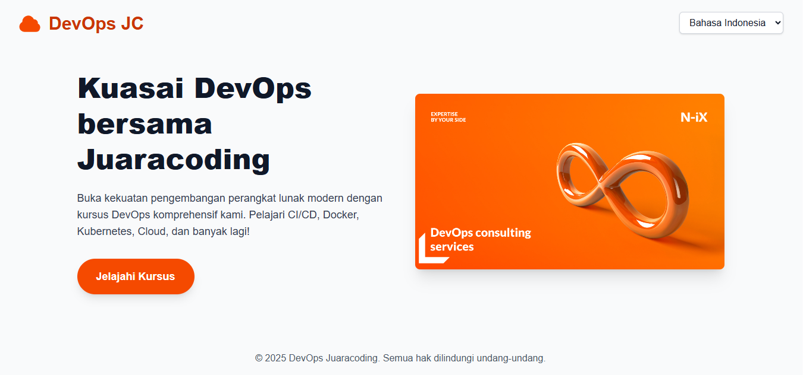

# DevOps Juaracoding Landing Page

This is a Next.js 15 project for the DevOps Juaracoding landing page, featuring multi-language support (English and Bahasa Indonesia), responsive design, and SEO optimization.

## Features

-   **Next.js 15**: Built with the latest version of Next.js.
-   **TypeScript**: Ensures type safety and better developer experience.
-   **Tailwind CSS**: For rapid and responsive UI development.
-   **Heroicons**: Used for the logo and other icons.
-   **Multi-language Support**: Implemented using `react-i18next` with English and Bahasa Indonesia translations.
-   **SEO Optimized**: Includes comprehensive metadata for better search engine visibility.
-   **Responsive Design**: Optimized for various screen sizes, including mobile.
-   **GitHub Actions CI/CD**: Automated deployment workflow to a production server via SSH.

## Getting Started

First, install the dependencies:

```bash
npm install
# or
yarn install
# or
pnpm install
# or
bun install
```

Then, run the development server:

```bash
npm run dev
# or
yarn dev
# or
pnpm dev
# or
bun dev
```

Open [http://localhost:3000](http://localhost:3000) (or the port indicated in your terminal) with your browser to see the result.

## Project Structure

-   `src/app/page.tsx`: The main landing page component.
-   `src/app/layout.tsx`: Root layout for the application, including global metadata and i18n provider.
-   `src/i18n.ts`: i18next configuration for multi-language support.
-   `src/components/I18nProvider.tsx`: Client component wrapper for `react-i18next`.
-   `public/locales/en/common.json`: English translation file.
-   `public/locales/id/common.json`: Bahasa Indonesia translation file.
-   `public/images/`: Contains hero image and favicons.
-   `.github/workflows/deploy.yml`: GitHub Actions workflow for deployment.
-   `next.config.ts`: Next.js configuration, including static export and image unoptimization.

## Deployment with GitHub Actions

This project includes a GitHub Actions workflow (`.github/workflows/deploy.yml`) to automate the deployment process to a production server via SSH.

### Setup for Deployment

1.  **GitHub Secrets**: Add the following secrets to your GitHub repository settings (`Settings > Secrets and variables > Actions`):
    *   `SSH_HOST`: The IP address or hostname of your server.
    *   `SSH_USERNAME`: The SSH username for your server.
    *   `SSH_PRIVATE_KEY`: Your SSH private key (ensure it's the one corresponding to the public key authorized on your server).
    *   `SSH_PORT`: The SSH port of your server (e.g., `22`).

2.  **Server Configuration**: Ensure your server is set up to receive SSH connections and has Node.js, npm, and a web server (like Nginx) or process manager (like PM2) configured to serve the Next.js application from `/var/www/main`. The deployment script in `deploy.yml` copies the built application to this directory. You may need to uncomment and adjust the `npm install --production` and application restart commands in the `script` section of `deploy.yml` based on your server setup.

## Screenshot



## Learn More

To learn more about Next.js, take a look at the following resources:

-   [Next.js Documentation](https://nextjs.org/docs) - learn about Next.js features and API.
-   [Learn Next.js](https://nextjs.org/learn) - an interactive Next.js tutorial.

## Buy me a coffe

If you like this project and want to support its further development, buy me a coffee!

[](https://www.buymeacoffee.com/kudajengke404)
